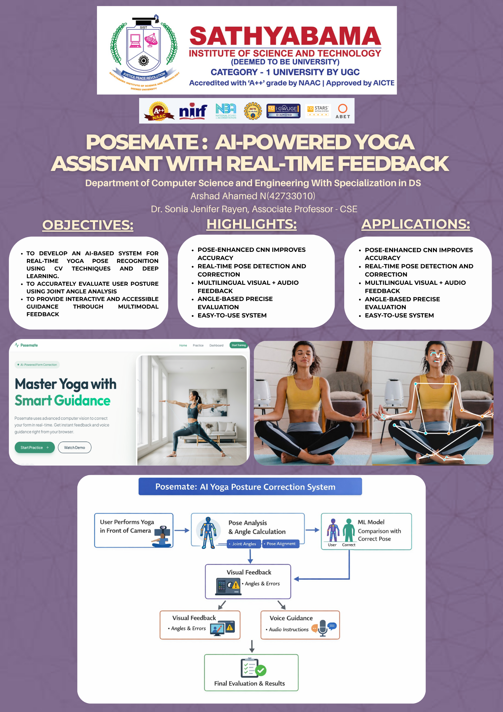

# PoseMate-AI
PoseMate is an AI-powered yoga pose detection and feedback system that leverages MediaPipe, Computer Vision, and Deep Learning to provide real-time posture analysis and personalized guidance for safe and effective home-based yoga practice.

  

